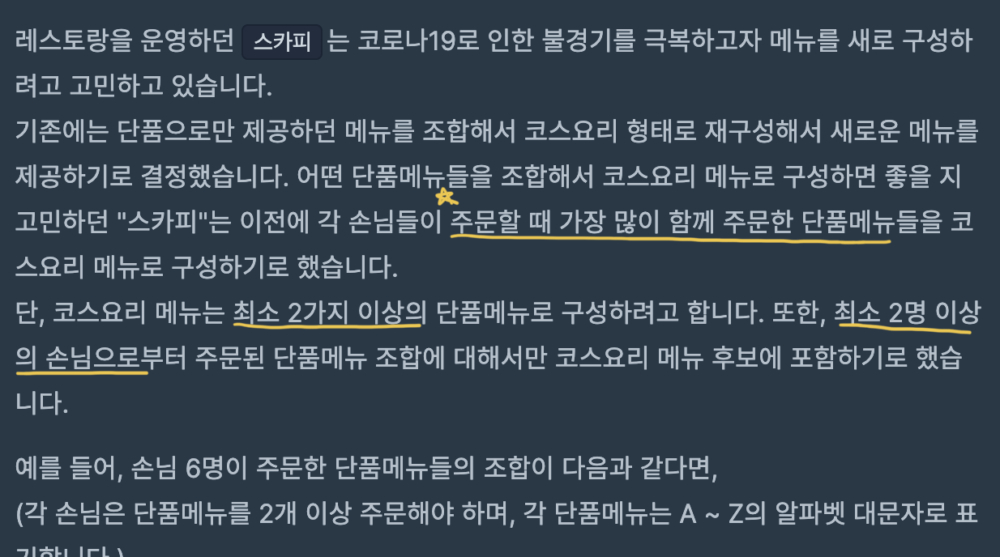

Created: July 3, 2021 5:16 PM
# 목차 
1. [메뉴 리뉴얼](#1.-메뉴-리뉴얼)
2. [한 줄로 서기](#2.-한-줄로-서기)
3. [스타트 링크](#3.-스타트-링크)

# 1. 메뉴 리뉴얼

[https://programmers.co.kr/learn/courses/30/lessons/72411](https://programmers.co.kr/learn/courses/30/lessons/72411)

## 1-1. 문제 요약

- 주문할 때 가장 많이 주문한 단품메뉴로 구성
- 최소 2명 이상의 손님이 주문



## 1-2. 아이디어 정리

defaultdict에 조합 메뉴 횟수를 담아 가장 많이 주문된 요리를 찾는 풀이를 진행 


## 1-3. 문제 풀이

### 1-3-1. 내 풀이

```python
"""
https://programmers.co.kr/learn/courses/30/lessons/72411
메뉴 리뉴얼
"""
from itertools import combinations
from collections import defaultdict

def solution(orders, course):
    """
    2명 이상 손님에게 주문된 가장 많이 함께 주문한 단품메뉴
    :param orders: 손님이 주문한 단품메뉴들
    :param course: 코스요리를 구성하는 단품메뉴 갯수
    :return:  코스요리 메뉴 - 오름차순
    """
    answer = []
    # 1. 원하는 단품메뉴 갯수 별 조합을 생성
    for c in course:
        order_dict = defaultdict(int)
        for order in orders:
            # 2. 해당 조합 개수를 센다
            for com in combinations(sorted(order), c):
                order_dict["".join(com)] += 1
        # 3. 가장 많이 주문된 메뉴을 확인하기 위해 정렬
        if order_dict:
            order_dict = sorted(order_dict.items(), key=lambda x: x[1], reverse=True)
            max_ = order_dict[0][1]
            # 예외처리 - 가장 많이 주문된 메뉴가 여러개인 경우 넣기
            for order in order_dict:
                if order[1] == max_ and order[1] >= 2:
                    answer.append(order[0])
                else:
                    break
    # 4. 정렬해서 리턴
    return sorted(answer)

```

### 1-3-2. 다른 사람 문제 풀이

- 내 풀이와 비슷하지만 다른 점은 Counter를 사용해서 호출된 횟수를 자동으로 셀 수 있도록 하여 간결하다. → 나의 코드에서는 dict 변수로 직접 횟수를 셌다.
- 리스트 컴프리헨션를 사용하여 for문을 한줄로 바꿔 간결하다.

```python
from itertools import combinations
from collections import Counter

def solution(orders, course):
    answer = []
    for c in course:
        temp = []
        for order in orders:
            combi = combinations(sorted(order), c)
            temp += combi
        counter = Counter(temp)
        if len(counter) != 0 and max(counter.values()) >= 2:
            answer += [''.join(f) for f in counter if counter[f] == max(counter.values())]

    return sorted(answer)
```

## 1-4. 결론

- 단순 구현 문제로 문제를 잘 읽으면 풀 수 있는 문제이다. 문제를 꼼꼼하게 읽어 예외처리할 부분을 찾는 것이 중요할 듯하다.
- 횟수를 셀 경우 Counter 모듈를 사용하여 더 간결하게 구현할 수 있다.

---

# 2. 한 줄로 서기

[https://www.acmicpc.net/problem/1138](https://www.acmicpc.net/problem/1138)

## 2-1. 문제 요약

- 자기보다 큰 사람이 왼쪽에 몇 명인지 알 수 있다.
- 줄을 선 순서대로 출력한다.


## 2-2. 아이디어 정리

 키가 작은 학생부터 왼쪽에 나보다 키가 큰 사람 수 만큼 자리를 비우고 맞는 순서에 배치한다. 예제 입력을 통해 직접 순서를 구현해보면 아래와 같다. 


## 2-3. 문제 풀이

### 2-3-1. 내 풀이

```python
"""
단순 구현 - 작은 사람부터 차례대로 채우기
"""
import sys

n = int(sys.stdin.readline())
arr = list(map(int, sys.stdin.readline().split()))
result = [0] * n

# 1. 키 작은 사람부터 결과 넣기
for i, a in enumerate(arr):
    count = 0  # 앞에 키큰 사람 넣은 횟수
    for j, res in enumerate(result):
        # 2. 아직 아무도 안 채워지고, 앞에 키큰 사람으로 더 채워야하는 경우: count 늘리기
        if res == 0 and count < a:
            count += 1
         # 3. 아직 아무도 안 채워지고, count 와 a가 동일한 경우: 현재 학생 넣기
        elif res == 0 and count == a:
            result[j] = i + 1
            break
print(*result)
```

## 2-4. 결론

 단순 구현 문제이다. 

---

# 3. 스타트 링크

[https://www.acmicpc.net/problem/5014](https://www.acmicpc.net/problem/5014)

## 3-1. 문제 요약

- S > G로 가기 위해 눌러야 하는 버튼의 수의 최솟값을 찾는 문제 → 탐색 문제


## 3-2. 아이디어 정리

BFS로 그래프 탐색을 진행하여 최솟값을 찾아 본다. 

1. S를 큐에 넣어 탐색을 시작한다. 
2. 위로 올라가는 경우: 방문을 안 했다면 큐에 넣고, 버튼 누른 수 저장 
3. 아래로 내려가는 경우: 방문을 안 했다면 큐에 넣고, 버튼 누른 수 저장

## 3-3. 문제 풀이

### 3-3-1. 내 풀이

```python
import sys
from collections import deque
"""
   S > G로 가기 위한 버튼의 수의 최솟값 - bfs 
"""
# 고층, 현재, 도착할 곳, 위, 아래
F, S, G, U, D = map(int, sys.stdin.readline().split())

visit = [-1] * (F + 1)  # 방문 유무 체크용 & 방문 횟수용 
dq = deque()
dq.append(S)
visit[S] = 0  # 방문 횟수 넣기

while dq:
    now = dq.popleft()
    # 1. 위로 올라가는 경우, 범위에 맞고 방문을 안 한경우: 결과 넣고 큐에 넣고 버튼 누를 수 저장 
    if now + U <= F and visit[now + U] == -1:
        visit[now + U] = visit[now] + 1
        dq.append(now + U)
    # 2. 아래로 내려가는 경우, 범위에 맞고 방문을 안 한경우: 결과 넣고 큐에 넣고 버튼 누를 수 저장
    if now - D >= 1 and visit[now - D] == -1:
        visit[now - D] = visit[now] + 1
        dq.append(now - D)

if visit[G] == -1:
    print("use the stairs")
else:
    print(visit[G])
```

## 3-4. 결론

 bfs문제로 이전에 풀어본 숨바꼭질 문제와 비슷하다. 비슷한 문제를 풀고 싶으면 아래 문제 링크를 풀어보자! 

* [숨바꼭질](https://www.acmicpc.net/problem/1697)